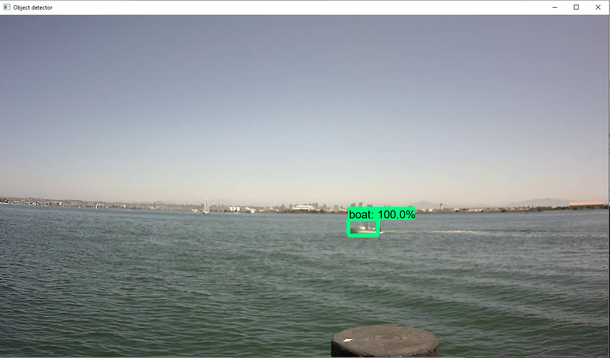

# This is a repository to hold the data for the AI Tracks at sea challenge
## This is a short walkthrough of how to train a neural network to identify the boat

This walkthrough was tested on my machine which is running on Windows 10 and will be using Tensorflow 1.14.


## Steps
### Step 1. Installing Dependencies (Anaconda, CUDA and cuDNN)
Firstly we will be using Anaconda to run our environment since it will allow things to run more smoothly. You can download [Anaconda here](https://www.anaconda.com/products/individual). Anaconda will recommend to use Python 3.8 as default for your machine, you can either choose to allow this or unselect it as we will be using a different version of python later on. Make sure that conda is in your path as it will be necessary for us to be able to use.
Secondly, we will be using CUDA v10.0 as it is what I tested and seemed to work best with these settings. You can download [CUDA here](https://developer.nvidia.com/cuda-10.0-download-archive?target_os=Windows&target_arch=x86_64&target_version=10&target_type=exenetwork).
Lastly, the cuDNN that we will be using to accompany the CUDA version will be cuDNN v7.4 for CUDA v10 which can be [downloaded here](https://developer.nvidia.com/rdp/cudnn-archive). ** Note that you will have to register for a developer account in order to download this.

### Step 2. Downloading files and preparing environment

#### Step 2a. Setup up Tensorflow directories
Create a folder on your machine named 'tensorflow' and place it into your C:\ drive. * We will need to make sure that everything in our directory is set up how it is in tensorflows repo * . You can then navigate to [Tensorflows github repo](https://github.com/tensorflow/models) and download their models repo and either clone or download a zip file and place it into the tensorflow folder. If you downloaded a zip file go ahead and extract it inside your tensorflow folder and change the name from 'models-master' to just 'models'.


#### Step 2b. Download the training model and config files
The training model I decided to use the ssd_mobilenet_v1_coco model which can be found [here](https://github.com/tensorflow/models/blob/master/research/object_detection/g3doc/tf1_detection_zoo.md). If you go to the page you can see that there are different models that have higher accuracy but consequently take longer so I believe this was a good option for speed and efficiency. You will also need the .config file for this which you can get [here](https://github.com/tensorflow/models/blob/master/research/object_detection/samples/configs/ssd_mobilenet_v1_pets.config) which is the same thing but using the configuration for pets rather than ordinary objects

#### Step 2c. Setting up conda environment
Open up a commmand window and enter this command
```bash
conda create -n tensorflow pip python=3.6
```
What we are doing is creating a new environment with the name of tensorflow and making sure it can use pip and setting the python version within the enironment as 3.6.

Next, to use our environment you we can activate it by using this command in our window:
```bash
conda activate tensorflow
```

We will then install tensorflow

